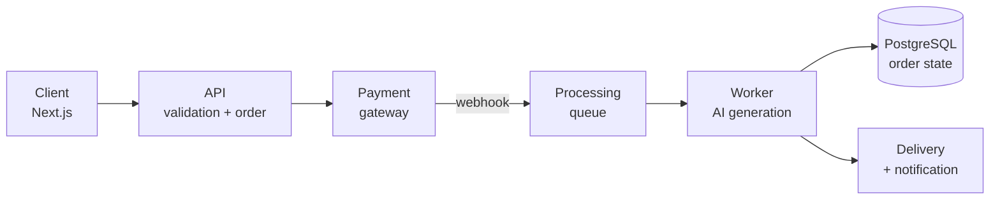

 

---

## About

Full stack developer working where **software engineering meets real retail operations**. I run the e-commerce of a mobile phone retail chain, so I don't ship a feature and walk away — I live with broken checkouts, stock mismatches and support tickets at 9pm.

That shaped how I build: **predictable, maintainable architecture over clever abstraction**, and design for the failure case first — offline machine, payment gateway timeout, tax rule that changes next quarter.

**Languages:** TypeScript · JavaScript · Java · Python · Go · SQL

---

## Languages I actually use

<picture>
  <source media="(prefers-color-scheme: dark)" srcset="https://github-readme-stats.vercel.app/api/top-langs/?username=elielfilhodev&layout=compact&theme=tokyonight&hide_border=true&bg_color=0D1117&title_color=0EA5E9&text_color=C9D1D9&langs_count=8&card_width=420" />
  
</picture>

| Language | Where I use it |
|:--|:--|
| **TypeScript** | Next.js, NestJS, Fastify — `strict: true`, no exceptions |
| **Java** | Spring Boot — REST APIs, service layer, JPA, business rules |
| **JavaScript** | Automation scripts, no-build institutional sites, quick integrations |
| **Python** | Marketplace automation, ETL, maintenance and analysis scripts |
| **SQL** | Modeling, migrations, indexes derived from real query plans |
| **Go** | Small services and CLIs where latency and a single binary matter |

---

## Tech Stack

<b>🎨 Frontend</b> — <i>Next.js · React · Vue · shadcn/ui · Tailwind · Figma</i>

 

App Router with Server Components by default; `"use client"` only where there is real interactivity — every client component is weight shipped to the user's browser. **shadcn/ui** enters my codebase as source, not as an opaque dependency, so I can audit and change it instead of fighting a third-party API.

<b>⚙️ Backend</b> — <i>NestJS · Fastify · Express · Spring Boot</i>

 

Layered architecture (`route → service → repository`), with external integrations always behind an interface — swapping payment gateways should be a new implementation, not a refactor of the domain. Input validated at the edge (Zod on Node, Bean Validation on Spring); errors handled explicitly, never swallowed in an empty `catch`.

Framework follows context: **NestJS** when structure and team conventions matter, **Fastify** when throughput and per-request overhead matter, **Express** for a small surface, **Spring Boot** when the ecosystem and transactional maturity are already Java.

<b>🗄️ Database & Cache</b> — <i>PostgreSQL · SQL Server · SQLite · Redis</i>

 

Relational by default — business data has shape, and referential integrity is the last line of defense when the application gets it wrong. PostgreSQL as the main choice, SQL Server where the ERP and legacy live, SQLite for local and test environments. Versioned, reversible migrations; indexes from execution plans, not guesses. **Redis is cache and queue, never the source of truth.**

<b>🚀 DevOps</b> — <i>Docker · Kubernetes · Terraform · CI/CD · Linux · AWS</i>

 

Reproducible environments in **Docker** with multi-stage builds and non-root containers — a smaller image is less attack surface, not just fewer MB. **Kubernetes** with health checks, resource limits and gradual rollout, so a bad release degrades instead of taking the service down. **Terraform**, because infrastructure clicked in a console is infrastructure nobody can rebuild at 3am. **CI/CD** with lint, tests and dependency scanning blocking merge; secrets in the provider's vault, never in the repository.

<b>🔐 Applied security</b> — <i>what I check before shipping</i>

 

| Risk | How I handle it |
|:--|:--|
| **Injection** | Parameterized queries and ORM; concatenated SQL is a bug, not a style |
| **Weak authentication** | Argon2/bcrypt hashing, short-lived tokens + rotated refresh, login rate limiting |
| **Data exposure** | Explicit output DTOs — a database entity never becomes an HTTP response |
| **Leaked secrets** | `.env` out of Git, secret manager on deploy, secret scanning in the pipeline |
| **Vulnerable dependencies** | Dependabot / `npm audit` in CI, updates as routine, not emergency |
| **Broken access control** | Authorization checked in the service layer — never only on the route or frontend |

---

## Projects

<b>🎵 meucarinho.com.br</b> — <i>AI music platform (solo product, zero to payment)</i>

 

AI-generated personalized songs — landing page, checkout, async pipeline, delivery and an internal backoffice.

`Next.js` `TypeScript` `Node.js` `PostgreSQL` `Redis` `Payment gateway` `Docker`

**Technical decision:** generation is asynchronous with state persisted at every step. The customer pays, gets immediate confirmation, and heavy processing happens outside the request cycle — a request blocked waiting on an AI model is a guaranteed timeout. The webhook is **idempotent**, because gateways resend notifications and double-charging is an incident, not a bug.

<b>🎸 luthierhossony.com</b> — <i>Institutional site, no framework</i>

 

Professional luthier's site built with plain **HTML, CSS and JavaScript**.

`HTML5` `CSS3` `JavaScript` `Responsive` `SEO` `Core Web Vitals`

**Technical decision:** the problem was a storefront and lead capture, not an application. A framework would only add bundle size, a build step and maintenance surface. **Choosing the smaller tool is an engineering decision, not the absence of one.**

<b>🛒 E-commerce operations & internal automation</b>

 

Running the online store of a mobile phone retail chain — catalog, stock, checkout, marketplaces and support — plus internal tools I built to cut manual work.

`Python` `TypeScript` `SQL Server` `PostgreSQL` `ERP integration`

**Technical decision:** every automation touching sales data ships with logging, idempotent execution and a dry-run mode before writing to production. A script running unattended against an ERP has to be auditable afterwards — and has to fail safely, not halfway.

---

## Activity

<picture>
  <source media="(prefers-color-scheme: dark)" srcset="https://github-readme-stats.vercel.app/api?username=elielfilhodev&show_icons=true&include_all_commits=true&count_private=true&hide_border=true&theme=tokyonight&bg_color=0D1117&title_color=0EA5E9&icon_color=0EA5E9" />
  
</picture>

---

## Education

| Title | Institution | Year |
|:--|:--|:--:|
| Technical Degree in Systems Analysis and Development | ETEC de Taquarituba | 2021 |
| Full Stack Java | EBAC | 2026 |

---

### Let's talk

If you hire for **full stack, frontend or backend** roles in e-commerce, payment products or internal tooling, I'd be glad to talk.

