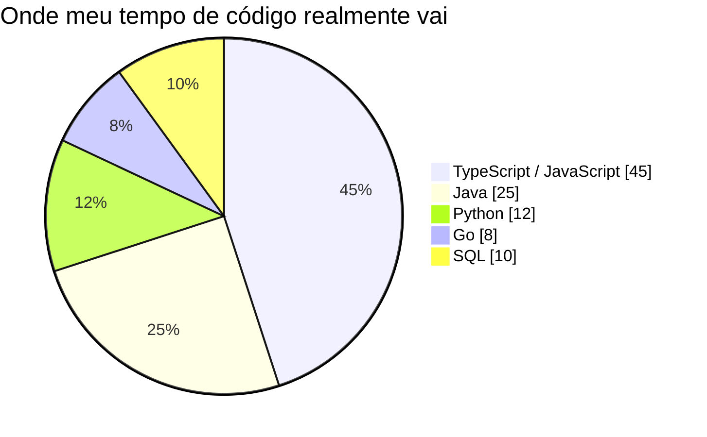
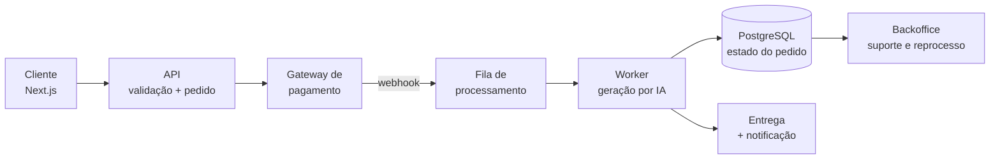

<div align="center">


<br/>

<a href="https://linkedin.com/in/eliel-filho-dev/"></a>
<a href="mailto:elielfilholk@gmail.com"></a>
<a href="https://elieldev-web.vercel.app"></a>
<a href="https://wa.me/5514998233642"></a>

<br/>


<br/><br/>

**[Sobre](#-sobre-mim)** &nbsp;·&nbsp; **[Linguagens](#-linguagens-que-eu-mais-uso)** &nbsp;·&nbsp; **[Stack](#️-stack-técnica)** &nbsp;·&nbsp; **[Projetos](#-projetos)** &nbsp;·&nbsp; **[Atividade](#-painel-de-atividade)** &nbsp;·&nbsp; **[Contato](#-vamos-conversar)**

</div>

---

## 👨‍💻 Sobre mim

```typescript
const eliel = {
  cargo: "Full Stack Developer",
  local: "São Paulo, Brasil 🇧🇷",
  linguagens: ["TypeScript", "JavaScript", "Java", "Python", "Go"],
  focoAtual: ["E-commerce", "APIs em produção", "Integrações de pagamento"],
  stackPrincipal: ["Next.js", "NestJS", "Spring Boot", "PostgreSQL", "Docker"],
  diferencial: "Opero e-commerce de verdade — construo software convivendo com as consequências dele",
  buscando: "Times que valorizam arquitetura sólida e entrega contínua",
} as const;
```

Sou desenvolvedor full stack atuando na fronteira entre **engenharia de software e operação real de varejo**. Hoje gerencio o e-commerce de uma rede de telefonia móvel — o que significa que não entrego funcionalidade e vou embora: eu convivo com checkout quebrado, obrigação fiscal, divergência de estoque e chamado de suporte às 21h.

Isso moldou meu jeito de construir: prefiro **arquitetura previsível e manutenível** a abstração inteligente, e projeto pensando primeiro no caso de falha — máquina offline, gateway de pagamento com timeout, regra tributária que muda no próximo trimestre.

---

## 🧠 Linguagens que eu mais uso

<div align="center">

<picture>
  <source media="(prefers-color-scheme: dark)" srcset="https://github-readme-stats.vercel.app/api/top-langs/?username=elielfilhodev&layout=compact&theme=tokyonight&hide_border=true&bg_color=0D1117&title_color=0EA5E9&text_color=C9D1D9&langs_count=8&locale=pt-br&card_width=420" />
  <source media="(prefers-color-scheme: light)" srcset="https://github-readme-stats.vercel.app/api/top-langs/?username=elielfilhodev&layout=compact&theme=default&hide_border=true&langs_count=8&locale=pt-br&card_width=420" />
  
</picture>

<br/>



</div>

> **Por que dois gráficos?** O card acima mede **bytes de código nos repositórios públicos** — ele conta o que está versionado aqui, não o que eu resolvo no dia a dia. O gráfico Mermaid abaixo é a **distribuição real de uso**, incluindo código privado, scripts internos e queries de operação. Mermaid ainda é renderizado nativamente pelo GitHub: não depende de serviço externo, não quebra por rate limit e acompanha o tema claro/escuro do usuário.

<div align="center">

| Linguagem | Onde eu uso de verdade | Domínio |
|:--|:--|:--|
| **TypeScript** | Next.js, NestJS, Fastify — tipagem estrita, `strict: true` sem exceção | `█████████░` |
| **JavaScript** | Scripts de automação, sites institucionais sem build, integrações rápidas | `████████░░` |
| **Java** | Spring Boot — APIs REST, camada de serviço, JPA e regras de negócio | `███████░░░` |
| **Python** | Automação de marketplace, ETL, scripts de manutenção e análise | `██████░░░░` |
| **Go** | Serviços pequenos e CLIs onde latência e binário único importam | `████░░░░░░` |
| **SQL** | Modelagem, migrations, índices tirados de query real e relatórios | `████████░░` |

</div>

---

## 🛠️ Stack Técnica

<div align="center">


</div>

<br/>

<details open>
<summary><b>🎨 &nbsp;Frontend</b> — <i>Next.js · React · Vue · shadcn/ui · Figma · Photoshop</i></summary>
<br/>

<div align="center">


</div>

> **Como eu trabalho aqui:** App Router com Server Components por padrão, `"use client"` só onde existe interatividade real — cada client component é peso enviado ao navegador do usuário. Componentes acessíveis via **shadcn/ui**, que entra no meu código como fonte e não como dependência opaca: consigo auditar e alterar em vez de brigar com a API de terceiro. **Vue** quando o projeto pede curva de entrada curta e reatividade direta. **Figma e Photoshop** entram antes do código — banner de campanha, ficha de produto e ajuste de imagem fazem parte da operação de e-commerce, não são etapa terceirizada.

</details>

<details>
<summary><b>⚙️ &nbsp;Backend</b> — <i>NestJS · Fastify · Express · Spring Boot</i></summary>
<br/>

<div align="center">


</div>

> **Como eu trabalho aqui:** arquitetura em camadas — `rota → serviço → repositório` — com integração externa sempre atrás de interface, para que trocar de gateway de pagamento seja uma implementação nova e não uma refatoração no domínio. Validação de entrada na borda (Zod no Node, Bean Validation no Spring): nenhum dado não validado atravessa a fronteira da aplicação. Erro é tratado explicitamente e nunca engolido em `catch` vazio.
>
> **Escolha de framework segue o contexto:** **NestJS** quando estrutura e time importam mais (DI, módulos, convenção compartilhada); **Fastify** quando throughput e overhead por request importam; **Express** para superfície pequena; **Spring Boot** quando o ecossistema, a maturidade transacional e o time já são Java.

</details>

<details>
<summary><b>🗄️ &nbsp;Banco de Dados & Cache</b> — <i>PostgreSQL · SQL Server · SQLite · Redis</i></summary>
<br/>

<div align="center">


</div>

> **Como eu trabalho aqui:** relacional como padrão — dado de negócio tem forma, e integridade referencial no banco é a última linha de defesa quando a aplicação erra. **PostgreSQL** como escolha principal, **SQL Server** onde o ERP e o legado da operação vivem, **SQLite** para ambiente local, testes e aplicação desktop sem servidor. Migrations versionadas e reversíveis, índices tirados de plano de execução real (não de palpite) e transação onde há consistência em jogo. **Redis é cache e fila — nunca fonte de verdade**; todo dado nele precisa poder ser reconstruído.

</details>

<details>
<summary><b>🚀 &nbsp;DevOps & Infraestrutura</b> — <i>Docker · Kubernetes · Terraform · CI/CD · Linux</i></summary>
<br/>

<div align="center">


</div>

> **Como eu trabalho aqui:** ambiente reproduzível em **Docker** com multi-stage build e container rodando como usuário sem privilégio — imagem menor é menos superfície de ataque, não só menos MB. **Kubernetes** com health checks, limites de recurso e rollout gradual, para que uma versão ruim degrade em vez de derrubar. **Terraform** porque infraestrutura clicada no console é infraestrutura que ninguém consegue recriar às 3h da manhã. **CI/CD** com lint, testes e varredura de dependência bloqueando merge — segredo mora no cofre do provedor, nunca no repositório. Log estruturado em JSON para depurar produção sem adivinhação.

**Deploy é evento chato e repetível — do jeito que tem que ser.**

</details>

<details>
<summary><b>🔐 &nbsp;Segurança aplicada</b> — <i>o que eu checo antes de subir</i></summary>
<br/>

| Risco | Como eu trato |
|:--|:--|
| **Injeção (SQL / NoSQL)** | Query parametrizada e ORM sempre; string concatenada em SQL é bug, não estilo |
| **Autenticação fraca** | Hash com Argon2/bcrypt, token de vida curta + refresh rotacionado, rate limit no login |
| **Exposição de dados** | DTO de saída explícito — a entidade do banco nunca vira resposta HTTP direta |
| **Segredos vazados** | `.env` fora do Git, secret manager no deploy, scan de segredo no pipeline |
| **Dependência vulnerável** | `npm audit` / Dependabot no CI, atualização como tarefa recorrente e não emergência |
| **Falha de controle de acesso** | Autorização checada no serviço, não só na rota — e nunca no frontend |

</details>

---

## 💼 Projetos

<details open>
<summary><b>🎵 &nbsp;meucarinho.com.br</b> — <i>Plataforma de música com IA (produto solo, do zero ao pagamento)</i></summary>
<br/>

Músicas personalizadas geradas por IA — landing page, checkout, pipeline assíncrono, entrega e backoffice próprio.

`Next.js` `TypeScript` `Node.js` `PostgreSQL` `Redis` `Gateway de pagamento` `Docker`



**Decisão técnica:** a geração é assíncrona com estado persistido em cada etapa. O cliente paga, recebe confirmação imediata e o processamento pesado acontece fora do ciclo de request — request travado esperando modelo de IA é timeout garantido e experiência ruim. O webhook é **idempotente**, porque gateway reenvia notificação e cobrar duas vezes é incidente, não bug. O backoffice existe porque suporte sem ferramenta vira consulta manual no banco de produção.

[](https://meucarinho.com.br)

</details>

<details>
<summary><b>🎸 &nbsp;luthierhossony.com</b> — <i>Site institucional sem framework</i></summary>
<br/>

Site de um luthier profissional, construído com **HTML, CSS e JavaScript puros**.

`HTML5` `CSS3` `JavaScript` `Design responsivo` `SEO` `Core Web Vitals`

**Decisão técnica:** o problema era vitrine e captação de contato, não aplicação. Framework aqui só adicionaria bundle, etapa de build e superfície de manutenção. Sem JavaScript de terceiros, a página carrega quase instantaneamente, indexa bem e continua funcionando daqui a três anos sem `npm audit fix`. **Escolher a ferramenta menor é uma decisão de engenharia, não falta dela.**

[](https://luthierhossony.com)

</details>

<details>
<summary><b>🛒 &nbsp;Operação de e-commerce & automações internas</b></summary>
<br/>

Gestão da loja online de uma rede de telefonia móvel — catálogo, estoque, checkout, marketplaces e suporte — com ferramentas internas que eu mesmo construí para reduzir trabalho manual.

`Python` `TypeScript` `SQL Server` `PostgreSQL` `Automação` `Integração com ERP`

**Decisão técnica:** toda automação que toca dado de venda nasce com log, execução idempotente e modo de simulação (*dry run*) antes de escrever em produção. Script que roda sozinho contra um ERP precisa poder ser auditado depois — e precisa falhar de forma segura, não pela metade.

</details>

---

## 📊 Painel de Atividade

<div align="center">

<picture>
  <source media="(prefers-color-scheme: dark)" srcset="https://github-readme-stats.vercel.app/api?username=elielfilhodev&show_icons=true&include_all_commits=true&count_private=true&hide_border=true&theme=tokyonight&bg_color=0D1117&title_color=0EA5E9&icon_color=0EA5E9&locale=pt-br" />
  <source media="(prefers-color-scheme: light)" srcset="https://github-readme-stats.vercel.app/api?username=elielfilhodev&show_icons=true&include_all_commits=true&count_private=true&hide_border=true&theme=default&locale=pt-br" />
  
</picture>

<br/>


<br/><br/>


<br/>


<br/>

<!--
  Animação "snake" das contribuições.
  Só aparece depois que o workflow .github/workflows/snake.yml rodar
  e gerar o arquivo na branch `output`. Descomente após a primeira execução.

<picture>
  <source media="(prefers-color-scheme: dark)" srcset="https://raw.githubusercontent.com/elielfilhodev/elielfilhodev/output/github-snake-dark.svg" />
  <source media="(prefers-color-scheme: light)" srcset="https://raw.githubusercontent.com/elielfilhodev/elielfilhodev/output/github-snake.svg" />
  
</picture>
-->

</div>

---

## 🎓 Formação & Certificações

| | Título | Instituição | Ano |
|:--:|:--|:--|:--:|
| 🎓 | Técnico em Análise e Desenvolvimento de Sistemas | ETEC de Taquarituba | 2021 |
| 📜 | Full Stack Java | EBAC | 2026 |
| 📜 | AWS Certified Developer – Associate (DVA-C02) | AWS Training & Certification | 2026 |

---

<details>
<summary><b>💬 &nbsp;Perguntas que costumam me fazer</b></summary>
<br/>

**Qual stack você escolhe para um projeto novo?**
Depende do problema, não do gosto. Produto web com SEO e time pequeno: Next.js + TypeScript + PostgreSQL. API de domínio com regra de negócio densa e time Java: Spring Boot. Serviço interno com throughput alto: Fastify ou Go. A pergunta que faço primeiro é "quem vai manter isso em dois anos?".

**Como você lida com integração de pagamento?**
Interface no domínio, implementação do gateway na borda, webhook idempotente, conciliação registrada e log de cada transição de estado. Pagamento é o lugar onde "quase funcionando" custa dinheiro real.

**Você trabalha com teste?**
Teste onde há risco: regra de negócio, cálculo, integração externa mockada e caminho de erro. Cobertura alta em código trivial é métrica bonita e inútil; teste de checkout que falha antes do merge é o que evita ligação no domingo.

**Modelo de trabalho?**
Remoto ou híbrido, aberto a CLT, PJ e projetos pontuais.

</details>

---

<div align="center">

## 📬 Vamos conversar

Se você contrata para vagas **full stack, frontend ou backend** em e-commerce, produtos com pagamento ou ferramentas internas, será um prazer conversar.

<a href="https://linkedin.com/in/eliel-filho-dev/"></a>
<a href="mailto:elielfilholk@gmail.com"></a>
<a href="https://elieldev-web.vercel.app"></a>
<a href="https://wa.me/5514998233642"></a>

<br/><br/>

<i>"Software que resolve problema real é melhor que software elegante que ninguém usa."</i>


</div>
